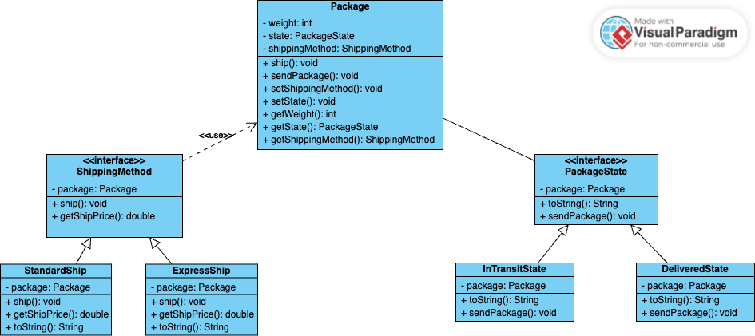

# کاربرد عملی الگوهای طراحی شئ‌گرا (Object Oriented Design Patterns)

## اعضای گروه

نگار نوبختی - 98171201

پریمهر مرصع‌فر - 98171148

## شرح آزمایش

برای پیاده‌سازی آزمایش بر اساس الگوهای state و  strategy برنامه را بر اساس class diagra زیر پیاده‌سازی می‌کنیم.

طبق دیاگرام، یک انتزاع PackageState وجود دارد که وضعیت‌های مختلف بسته آن را پیاده‌سازی می‌کنند. این انتزاع packageای را که به آن تعلق دارد در خود ذخیره می‌کند و یک متد sendPackage دارد که بسته آن را فراخوانی می‌کند. در صورتی که وضعیت بسته از نوع InTransitState باشد، وضعیت آن به DeliveredState تغییر می‌کند و در غیر اینصورت در وضعیت خود باقی می‌ماند. بدین صورت الگوی state برآورده می‌شود.

برای برآورده کردن الگوی Strategy، یک انتزاع shippingMethod را پیاده‌سازی می‌کنیم، که روش‌های مختلف ارسال آن را پیاده‌سازی می‌کنند. با هر بار تغییر روش ارسال بسته شیوه ارسال را در خود ذخیره می‌کند و با اجرای تابع ship()، تابع مربوطه در روش ارسال بسته نیز فراخوانی شده و پیغام و قیمت مربوط به خود را چاپ می‌کند. بدین صورت الگوی strategy نیز برآورده می‌شود.

## پرسش‌ها
1. در کتاب GoF سه دسته الگوی طراحی معرفی شده است. آن‌ها را نام ببرید و در مورد هر دسته در حد دو خط توضیح دهید.

- **creational**: این دسته از الگو‌ها مربوط به شیوه ایجاد موجودیت‌ها هستند، به شکلی که متناسب با مساله باشند. زیرا ایجاد موجودیت‌ها در ابتدایی‌ترین شکل خود می‌تواند در بعضی مسائل پیچیدگی‌هایی را ایجاد کند.
- **structural**: این نوع الگو‌ها رابطه میان موجودیت‌ها را مدیریت می‌کنند و تعیین می‌کنند که موجودیت‌های مختلف به چه صورتی باید در کنار هم قرار بگیرند تا ساختارهای بزرگ‌تر را ایجاد کنند.
- **behavioral**: این دسته از الگوها بر نحوه ارتباط و تقسیم وظایف میان موجودیت‌ها نظارت دارند. با استفاده از این الگوها می‌توان انعطاف را در ارتباط میان موجودیت‌ها افزایش داد.

2. الگوهای استفاده شده در این آزمایش جزو کدام دسته هستند؟

هر دو الگو از نوع behavioral هستند.

3. با توجه به این که در هر اجرا محصرا یک بسته داریم و هیچ بسته‌ی دیگری بجز آن نداریم، کدام الگوی طراحی را برای ایحاد آن مناسب می‌دانید؟ ضمن بیان علت انتخاب خود، نحوه تحقق الگو را به طور کامل توضیح دهید.

4. تحقق و یا عدم تحقق هر کدام از اصول SOLID را در خصوص الگوی طراحی Singleton بیان کنید (هرکدام حداکثر در سه خط).
